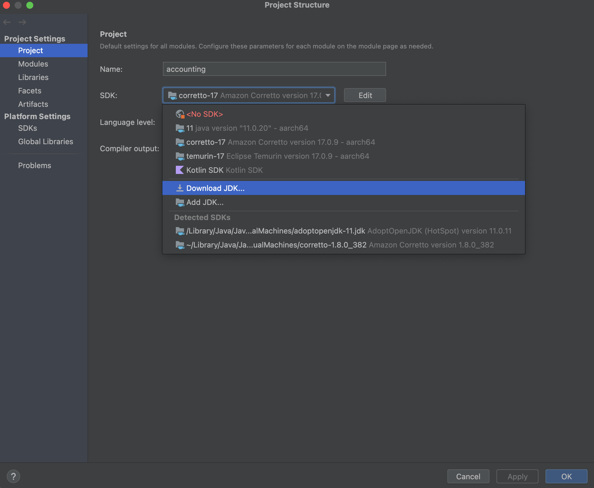
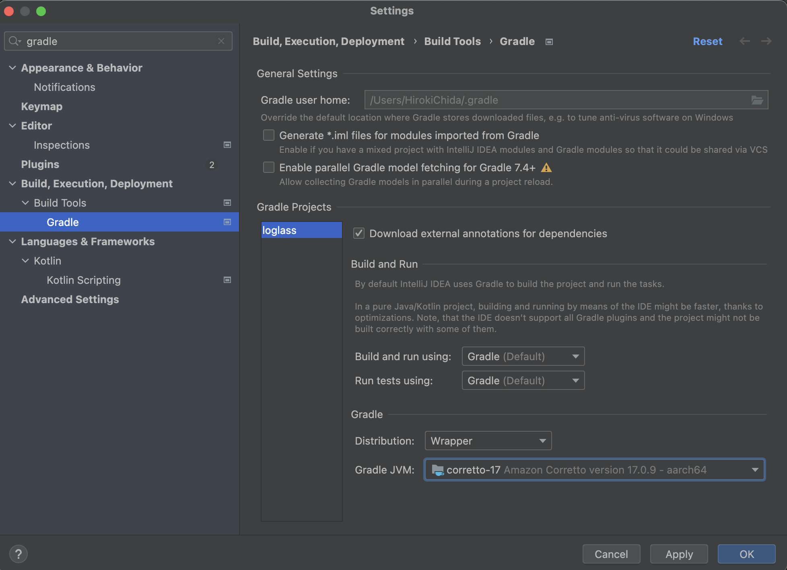
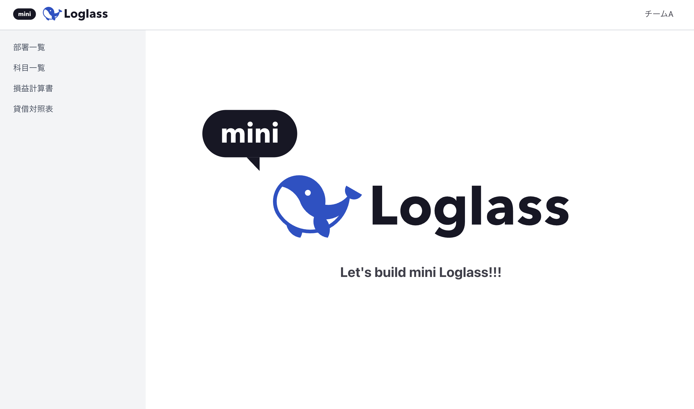

# Mini Loglass - サマーインターン用アプリケーション

## 前提条件
- Java 17
- Node.js (npm)
- Docker Desktop
- IntelliJ IDEA Community Edition

## セットアップ手順

### 1. 開発環境の準備

#### 1.1 IntelliJ IDEA Community Editionのインストール
- [IntelliJ Community Edition](https://www.jetbrains.com/ja-jp/idea/download/)をダウンロード
- 「IntelliJ IDEA Ultimate」ではなく、「IntelliJ IDEA Community版」を選択してください

#### 1.2 Docker Desktopのインストール
- [Docker Desktop](https://docs.docker.com/get-started/introduction/get-docker-desktop/)をインストール
- [日本語インストールガイド（非公式）](https://matsuand.github.io/docs.docker.jp.onthefly/desktop/mac/install/)

インストール後、以下のコマンドで確認：
```bash
docker --version
docker compose version
```

### 2. IntelliJ IDEAの設定

#### 2.1 プロジェクトを開く
IntelliJ IDEAでプロジェクトフォルダを開きます

#### 2.2 Java 17の設定
1. メニュー: File > Project Structure
2. Java 17をインストール/選択
<div style="text-align: center;"></div>

#### 2.3 Gradleの設定
1. メニュー: IntelliJ IDEA > Settings（Windowsの場合はFile > Settings）
2. 「Gradle」で検索
3. Gradle JVMがJava 17になっていることを確認
<div style="text-align: center;"></div>

### 3. アプリケーションの起動

#### 3.1 データベースの起動
```bash
# MySQLコンテナを起動
make db/start

# データベースに接続して確認
make db/sql
# 以下が表示されればOK
# mysql> 
```

#### 3.2 フロントエンドの起動
```bash
cd frontend
npm install
npm run dev
```

#### 3.3 バックエンドの起動
```bash
# プロジェクトルートディレクトリで実行
make run
```
※ サーバー起動時に自動的にデータベースマイグレーションが実行されます

### 4. アプリケーションへのアクセス

✅ 正常に起動し、ブラウザで `http://localhost:3000/` にアクセスすると以下の画面が表示されます：
<div style="text-align: center;"></div>

## 技術スタック
- **バックエンド**: Spring Boot (Kotlin), Gradle
- **フロントエンド**: Next.js, React, TypeScript, Tailwind CSS
- **データベース**: MySQL (Docker)
- **マイグレーション**: Flyway

## よく使うコマンド

### アプリケーション全体
```bash
make run         # アプリケーション全体を起動（DB起動 → 待機 → サーバー起動）
```

### フロントエンド関連
```bash
make front/start # フロントエンドサーバーを起動（npm run dev）
```

### バックエンド関連
```bash
make server/start # Spring Bootサーバーを起動
```

### データベース関連
```bash
make db/start    # MySQLコンテナをバックグラウンドで起動
make db/reset    # DBテーブルを全削除して再作成（マイグレーション再実行）
make db/down     # MySQLコンテナを停止してボリュームも削除（データも消去）
make db/sql      # MySQLクライアントでDBに接続
make db/admin    # phpMyAdminをブラウザで開く（http://localhost:2222）
```

### 各コマンドの詳細説明

#### `make run`
- データベースを起動し、起動完了を待ってからSpring Bootサーバーを起動します
- 内部的に `make db/start` → `wait-for-db.sh` → `make server/start` の順で実行されます

#### `make db/reset`
- Flywayを使用してデータベースをクリーンアップし、マイグレーションを再実行します
- 開発中にスキーマを変更した際のリセットに便利です
- **注意**: 本来の開発フローでは、マイグレーションファイルを編集することはありません。また、本番環境でテーブルを削除することもありません。このコマンドはローカル開発環境でのみ使用してください

#### `make db/down`
- MySQLコンテナを停止し、データボリュームも削除します
- データベースの内容を完全にリセットしたい場合に使用します

## トラブルシューティング

### データベース接続エラーの場合
1. Dockerが起動していることを確認
2. `make db/start`でMySQLコンテナが起動していることを確認
3. コンテナが正常に動作しているか`docker ps`で確認

## 参考ドキュメント
- [インターン課題Excel](./doc/インターン資料.xlsx)

## 注意事項
- ソースコードの公開はしないように協力お願いします
- 本来であればテストコードは書きますが、インターンの時間の都合上書いていません
